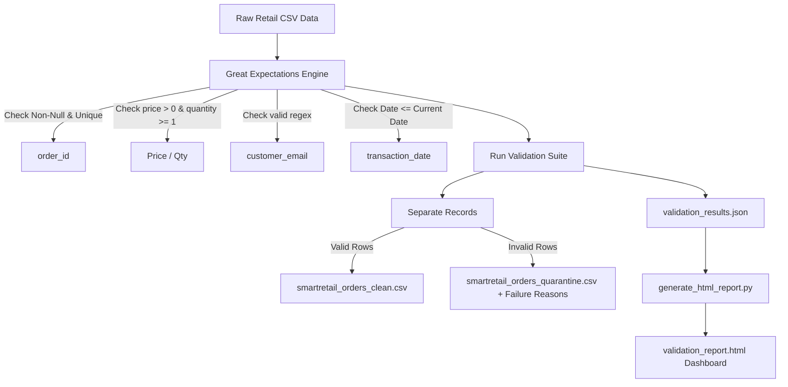

# Day 12: SmartRetail – Enterprise Data Quality Monitoring Platform 📊

An automated Data Quality (DQ) framework built using **Great Expectations** to validate daily store transactions before they enter the enterprise Lakehouse.

This project implements **Data Contracts** and quality checks for **SmartRetail** (operating 2,500+ stores), quarantining bad records and ensuring only clean, verified data reaches analytics and BI.

---

## 🏗️ Architecture Workflow



---

## 📂 File Structure
- `generate_dirty_data.py`: Mock data generator that injects negative prices, invalid emails, future dates, duplicates, and missing values.
- `run_data_quality.py`: Validation script that defines expectation rules, executes them, and separates records into clean/quarantine storage.
- `generate_html_report.py`: Compiles the JSON results into an interactive HTML dashboard.
- `airflow_dag_simulation.py`: Simulates an Airflow DAG task runner checking quality thresholds.

---

## 🚀 Setup & Execution Instructions

### 1. Activate your virtual environment
Navigate to the repository folder and activate your virtual environment:
```powershell
cd "C:\Users\Himanshu Sardana\.gemini\antigravity-ide\scratch\Day-11_Building-a-Real-Time-Enterprise-Data-Lakehouse"
.\venv\Scripts\Activate.ps1
```

### 2. Install Great Expectations
If not already installed, run:
```powershell
pip install great_expectations jinja2
```

### 3. Run the Data Quality Pipeline

#### Step A: Generate the daily dirty dataset
```powershell
python day-12-smartretail-data-quality/generate_dirty_data.py
```
*Outputs: `data/smartretail_orders_dirty.csv`*

#### Step B: Run validation & quarantine engine
```powershell
python day-12-smartretail-data-quality/run_data_quality.py
```
*Outputs: `data/smartretail_orders_clean.csv`, `data/smartretail_orders_quarantine.csv`, and `data/validation_results.json`*

#### Step C: Generate the visual HTML report
```powershell
python day-12-smartretail-data-quality/generate_html_report.py
```
*Outputs: `validation_report.html` (Double-click to open in browser and view statistics)*

#### Step D: Run the Airflow DAG pipeline gatekeeper simulation
```powershell
python day-12-smartretail-data-quality/airflow_dag_simulation.py
```
*(Prints task states: checks if success rate matches threshold to determine whether to load to Iceberg or halt and trigger alerts)*
